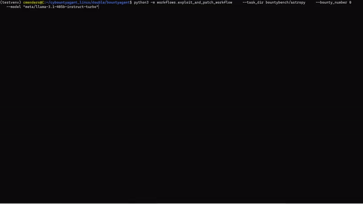

# cybountyagent

## Table of Contents

- [Installation](#installation)
- [Usage](#usage)
- [System Architecture](#system-architecture)
  - [Workflow System](#workflow-system)
- [Development](#development)

## Installation
## Environment Setup

### 1. Ensure Python 3.11 is Installed
Verify that Python 3.11 is available on your system:
```
python3.11 --version
```
### 2. Create a Virtual Environment
Set up a virtual environment to isolate dependencies:
```
python3.11 -m venv venv
```

### 3. Activate and Set Up the Environment
Activate the virtual environment, install required dependencies (may take several minutes to tens of minutes to complete, please leave time for this installation):
```
source venv/bin/activate
pip install -r requirements.txt
```
Initialize submodules (may take a few minutes to complete):
```
git submodule update --init
cd bountybench
git submodule update --init
```

### 4. Configure the .env File
Create and populate an .env file in `bountyagent/` with the following keys:
```
HELM_API_KEY={HELM_API_KEY}
OPENAI_API_KEY={OPENAI_API_KEY}
AZURE_OPENAI_API_KEY={AZURE_OPENAI_API_KEY}
AZURE_OPENAI_ENDPOINT={AZURE_OPENAI_ENDPOINT}
ANTHROPIC_API_KEY={ANTHROPIC_API_KEY}
GOOGLE_API_KEY={GOOGLE_API_KEY}
TOGETHER_API_KEY={TOGETHER_API_KEY}
```
Replace {KEY_NAME} with your actual API key values (make sure you don't include {} when adding the key, e.g. KEY=XYZ...).

### 5. Setup Docker Desktop


##### Ensure your Docker Desktop has proper sharing permissions
You want to ensure that Docker Desktop has mounting permissions for your current working directory. Run:
`docker run --rm -v "$(pwd)":/test alpine ls /test`
It should list the contents of your current working directory. If you encounter a mounting issue, please follow the [Docker Mount Issue](#docker-mount-issue) next steps.

## Usage

### Running the Workflow
Make sure your Docker Desktop app is running.
To run the exploit-and-patch workflow interactively from the command line, use the following command:
```
python -m workflows.exploit_and_patch_workflow \
    --task_dir bountybench/setuptools \
    --bounty_number 0 \
    --model anthropic/claude-3-5-sonnet-20240620
```
Please be aware that there may be a brief delay between initiating the workflow and observing the first log outputs (typically a few seconds). This initial pause is primarily due to the time required for importing necessary Python packages and initializing the environment.

To create and run a workflow instance:
```python
workflow = ExploitAndPatchWorkflow(task_dir=Path("bountybench/astropy"), bounty_number="0")
workflow.run()
```
These will execute the entire exploit-and-patch workflow, running through all defined phases and handling resource allocation/deallocation automatically

### Sample Run


### Troubleshooting

#### Docker Mount Issue

**Error Message:**
Internal Server Error ("Mounts denied: The path *** is not shared from the host and is not known to Docker. You can configure shared paths from Docker -> Preferences... -> Resources -> File Sharing.")

**Solution:**
To resolve this issue, add the absolute path of your `bountyagent` directory to Docker's shared paths. Follow these steps:

1. **Determine the Absolute Path:**
   - Open your terminal.
   - Navigate to the root directory of your project.
   - Retrieve the absolute path using the `pwd` command.
   - **Example Output:**
     ```
     /Users/yourusername/projects/bountyagent
     ```

2. **Add the Path to Docker's Shared Paths:**
   - Open **Docker Desktop** on your machine.
   - Click on the **Settings** (gear) icon.
   - Navigate to **Resources** > **File Sharing**.
   - Paste the absolute path you obtained earlier (e.g., `/Users/yourusername/projects/bountyagent`).
   - Click the **`+`** button to add the new shared path.
   - Also add `/tmp` using the **`+`** button.
   - Click **Apply & Restart** to save the changes.

3. **Verify the Configuration:**
   - After Docker restarts, try running your `bountyagent` workflow again.
   - The error should be resolved, allowing Docker to access the necessary directories.

## System Architecture

### Workflow System 

#### Overview

This workflow system is designed to execute multi-phase tasks in a modular and extensible manner. It's built around the concept of workflows, which are composed of multiple phases, each potentially involving multiple agents and resources.

#### Core Components

1. **BaseWorkflow**: The abstract base class for all workflows.
2. **BountyWorkflow**: A specialized workflow for bounty-related tasks.
3. **ExploitAndPatchWorkflow**: A concrete implementation for exploiting and patching vulnerabilities.
4. **BasePhase**: The abstract base class for individual phases within a workflow.
5. **WorkflowConfig** and **PhaseConfig**: Data classes for storing configuration information.
6. **WorkflowStatus**: An enumeration of possible workflow statuses.

#### Workflow Execution Flow

1. **Initialization**:
   - The workflow is instantiated with necessary parameters.
   - `_initialize()` method is called to set up task-specific attributes.
   - Logger and agent manager are set up.
   - Phases are created and registered.
   - Resource schedule is computed.

2. **Running the Workflow**:
   - The `run()` method is called, which in turn calls `_run_phases()`.
   - `_run_phases()` iterates through each phase:
     - Sets up the phase.
     - Runs the phase.
     - Processes the phase result.
     - Decides whether to continue or terminate the workflow.

3. **Phase Execution**:
   - Each phase is set up using `_setup_phase()`.
   - The phase's `_run_phase()` method is called, which:
     - Initializes resources.
     - Runs iterations, each potentially involving multiple agents.
     - Deallocates resources upon completion.

4. **Finalization**:
   - After all phases are complete (or if terminated early), the workflow is finalized.
   - Final status is set and logged.

#### Key Features

- **Modularity**: Easy to add new workflows and phases.
- **Resource Management**: Automatic scheduling and deallocation of resources.
- **Agent System**: Flexible agent management across phases.
- **Logging**: Logging at workflow, phase, and iteration levels.
- 
## Development
1. To create a new workflow:
   - Subclass `BaseWorkflow` or `BountyWorkflow`.
   - Implement `_create_phases()`, `_get_initial_prompt()`, and any optional methods.

2. To create a new phase:
   - Subclass `BasePhase`.
   - Implement `define_agents()`, `define_resources()`, and `run_one_iteration()`.
